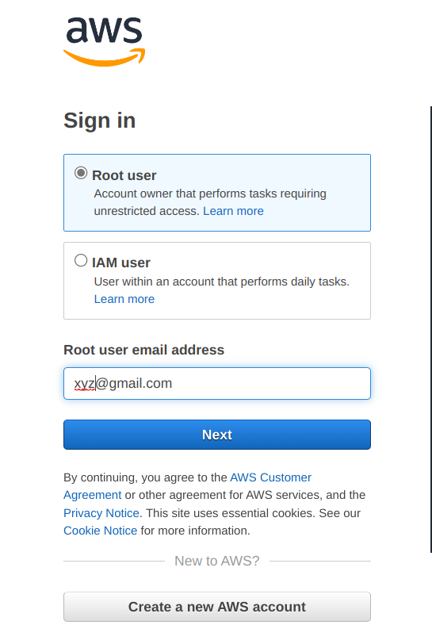
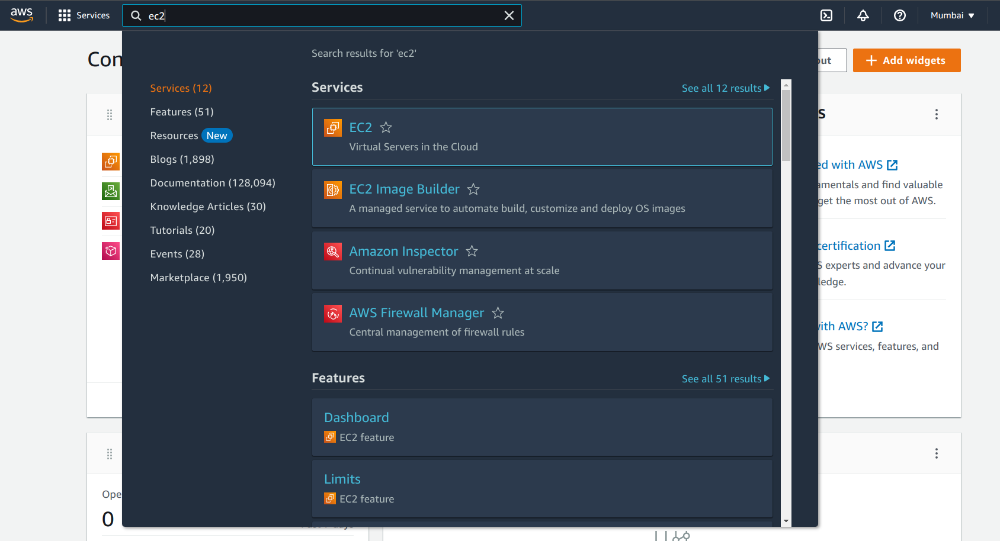
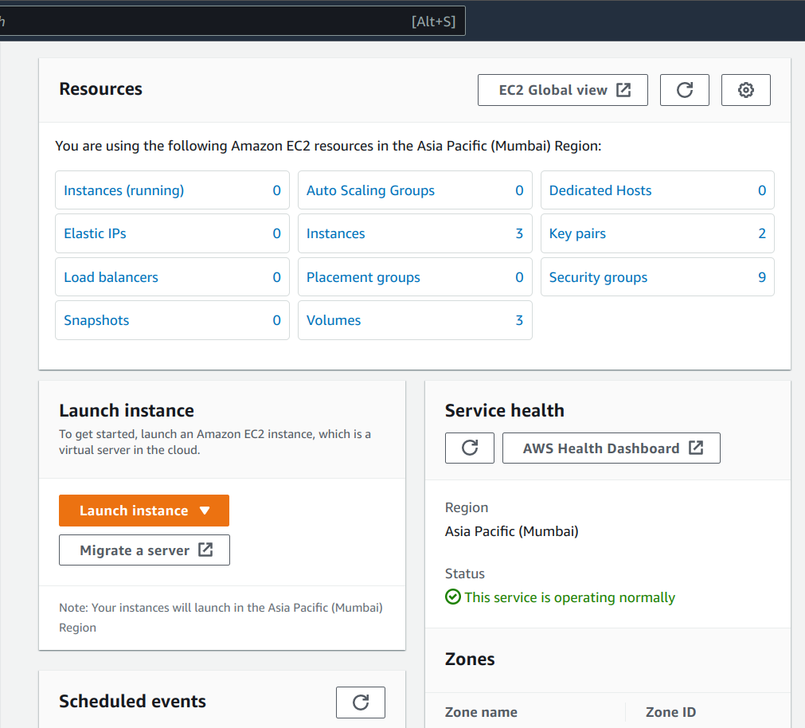
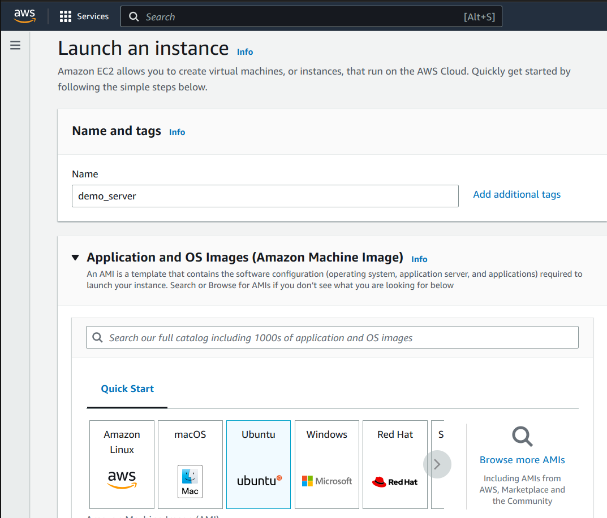
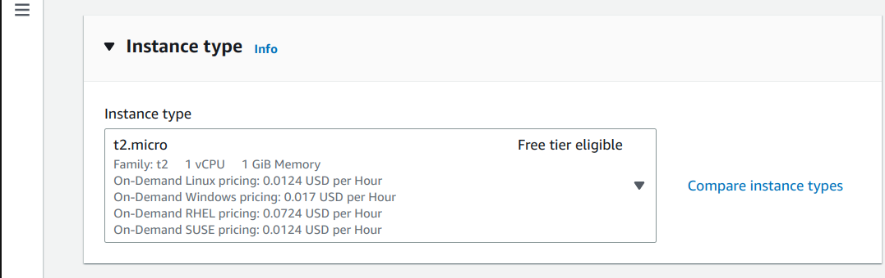
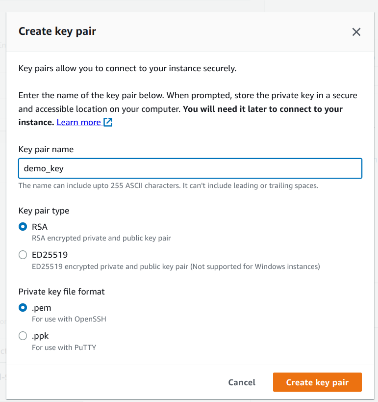
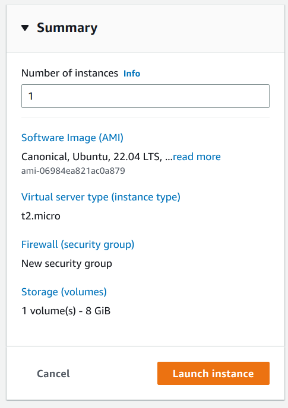
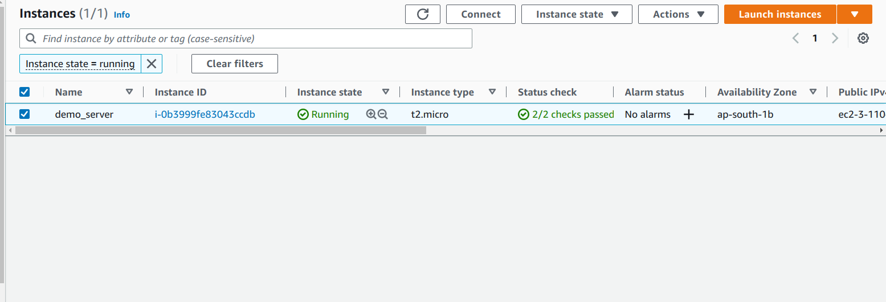
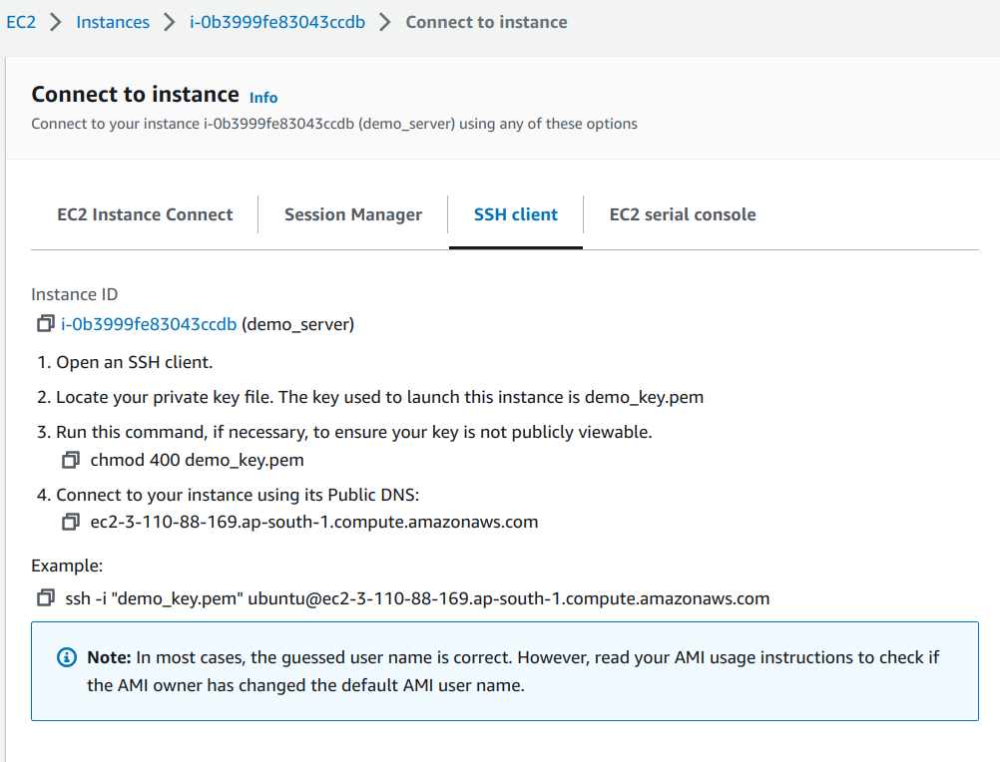
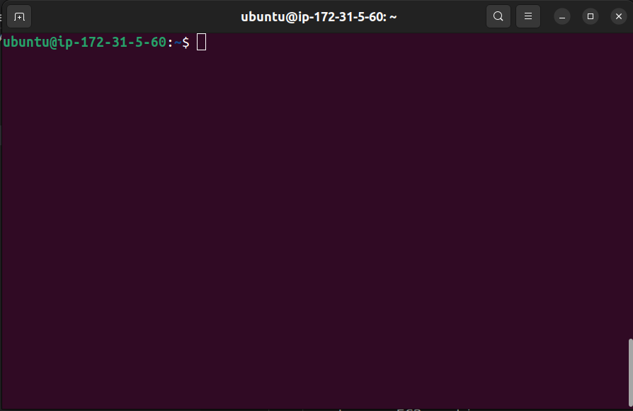

# Practical applications of IAAS, PAAS and SAAS

- In this article I'm not explaining what is IAAS, PAAS or SAAS, rather I'm pratical demonstrating the differences among them.

## IAAS
- IAAS or Infrastructure as a service provides infrastructure for our product like networking, storage, servers, virtualization.

- Other infrastructure aspects are managed by developers like OS, Middleware etc.

- The best example for understanding IAAS is Amazon EC2 machine.

    

    

### So what is Amazon EC2?
- AWS EC2 or Elastic Compute Cloud is a IaaS provided by amazon which works on pay-as-you-go model. EC2 allows users to rent virtual computers on which to run their own computer applications.

- In simple terms, it is an enviroment provided by amazon which we can access through internet.

- Now let us see how it works -
    - __How to create an EC2 instance ?__
    - You can skip this part if you know how to create a EC2 instance.
    - First step is to signin or signup in [AWS](aws.amazon.com).
    

        
    
  
    - Search ec2 in the search bar and click on the first option i.e EC2.
    

        
    
  
    - This is EC2 dashboard. To create a new EC2 instance click Launch instance.
    

        
    
  
    - Now let us create our EC2 instance.

        - Name your EC2 instance like demo_server (optional).

        - Select OS you want to work with. For the sake of simplicity I'm selecting Ubuntu OS because it is familier with most of us.

        

        
        

        - Select t2.micro as instance type.

        

        
        
        
        - For accessing the EC2 machine, we need a key-pair.Create a new-key pair.
        

        
        

        - A key will be downloaded .
                
        - Now click on launch instance.
        

        
        
        
        - Our instance is running on AWS. Click on connect to connect with our EC2 machine.
        

        
        

        - Follow the below steps to connect via SSH client.
        

        
        

        - Yay, we have successfully connected to our EC2 machine.
        

        
        

        - We can run or host any server on our machine like a node or a python
        application but cloning a project from a remote repo like github.

        - So this machine is an IaaS because a developer has to care about creating and maintaing OS, data, middleware as well as code for application.

## PaaS
- 
